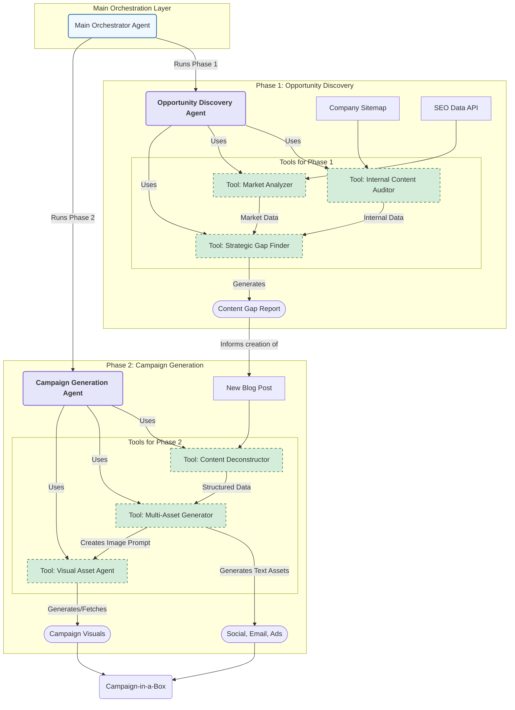

# SYSTEM DESIGN: The End-to-End Content Engine

**Author**: Antigravity (AI Assistant)
**Version**: 1.0

## 1. Overview & Business Objectives

This document outlines the system architecture for **The End-to-End Content Engine**, an integrated, multi-agent AI system designed to automate the entire content marketing lifecycle. The system addresses the critical business challenge of slow, inefficient content marketing by creating a unified, agile content machine.

*   **The Business Problem**: Content marketing efforts are disconnected. Manual research for SEO opportunities is time-consuming, and the promotion of published content is inconsistent, leading to a low return on investment.
*   **The C-Suite Objective**: To increase organic search traffic by 25% and double the speed of promotional campaign launches.

## 2. Guiding Principles & Technology Philosophy

*   **Agentic & Autonomous**: The system will be composed of specialized AI agents that can work independently and collaboratively to achieve complex goals.
*   **Powered by Gemini**: We will leverage the **Google Gemini family of models** (including Pro and Flash) for their advanced reasoning, multi-language, and multi-modal capabilities.
*   **Scalable & Serverless**: The architecture will be built on Google Cloud's serverless platform (Cloud Run, Cloud Functions) to ensure scalability, cost-efficiency, and operational simplicity.
*   **Modular & Extensible**: Each component is designed to be a discrete service, allowing for independent development, deployment, and future expansion.

## 3. High-Level System Architecture

The system is designed as a **hierarchical multi-agent architecture**. A top-level **Orchestrator Agent** manages the end-to-end workflow by delegating tasks to two primary sub-agents, each responsible for a distinct phase. These sub-agents, in turn, utilize a suite of specialized **Tool Agents** to execute granular tasks.

1.  **Phase 1: Opportunity Discovery**: The `Opportunity Discovery Agent` acts as an AI-powered SEO Strategist.
2.  **Phase 2: Campaign Generation**: The `Campaign Generation Agent` acts as an AI Campaign Creator.

### ASCII Architecture Diagram

```
+------------------------------------------------------------------------------------+
|                                 MAIN ORCHESTRATOR AGENT                              |
|                     (Manages workflow, calls Phase Agents as Tools)                  |
+------------------------------------------------------------------------------------+
                 |                                                 |
(Phase 1 Trigger) |                                                 | (Phase 2 Trigger)
                 v                                                 v
+---------------------------------+             +------------------------------------+
| OPPORTUNITY DISCOVERY AGENT     |             |    CAMPAIGN GENERATION AGENT       |
| (Sub-Agent for Phase 1)         |             |    (Sub-Agent for Phase 2)         |
+---------------------------------+             +------------------------------------+
    |       |               |                       |              |               |
    v       v               v                       v              v               v
[Tool:   [Tool:          [Tool:         [Tool:          [Tool:         [Tool:        ]
[Internal [Market         [Strategic    [Content        [Asset         [Visual       ]
[Auditor]] [Analyzer]      [Gap Finder]]  [Deconstructor]] [Generator]]   [Asset Agent]]
    |       |               |                       |              |               |
    v       v               |                       |              |               |
[Site   ] [SEO Data      ]   |                       |              |               |
[Content] [via API       ]   |                       |              v               v
    |       |               |                       |           [Text Assets] [Image]
    `-------+---------------`                       `--------------+---------------+`
            |                                                      |
            v                                                      v
[Content Gap Report]                                 [Campaign-in-a-Box]

```

### Mermaid Graph Architecture



## 4. Component Breakdown & Technology Stack

### Data Sources

| Source                      | Type              | Ingestion Method                                    |
| --------------------------- | ----------------- | --------------------------------------------------- |
| **Company Blog/Sitemap**    | Internal          | Web Scraper (e.g., Python w/ BeautifulSoup, Scrapy) |
| **Competitive SEO Data**    | External          | REST API (e.g., SEMrush, Ahrefs, Google Trends API)   |
| **Image Library**           | Internal          | Google Cloud Storage (GCS) Bucket                   |
| **New Long-Form Content**   | Internal (Input)  | URL submitted via a simple web interface or API     |

### Agent Hierarchy

| Agent Tier              | Name                            | Core Technology             | Function                                                                           |
| ----------------------- | ------------------------------- | --------------------------- | ---------------------------------------------------------------------------------- |
| **Level 0: Orchestrator** | `Main Orchestrator Agent`       | Cloud Run                   | Manages the entire workflow, state, and calls Phase Agents.                        |
| **Level 1: Sub-Agent**    | `Opportunity Discovery Agent`   | LangChain / Gemini Function Calling | Executes Phase 1 by invoking its specialized tools to produce the Gap Report.      |
| **Level 1: Sub-Agent**    | `Campaign Generation Agent`     | LangChain / Gemini Function Calling | Executes Phase 2 by invoking its tools to produce the Campaign-in-a-Box.           |

### Tool Agents (Level 2)

| Phase   | Tool Agent                  | Model                           | Function                                                                         |
| ------- | --------------------------- | ------------------------------- | -------------------------------------------------------------------------------- |
| Phase 1 | `Internal Content Auditor`  | Gemini Pro                      | Scrapes and analyzes internal content to determine topic authority.              |
| Phase 1 | `Market Analyzer`           | Gemini Pro                      | Fetches and analyzes SEO/trend data to find competitor/market opportunities.     |
| Phase 1 | `Strategic Gap Finder`      | Gemini Pro                      | Compares internal vs. market data to produce a prioritized `Content Gap Report`. |
| Phase 2 | `Content Deconstructor`     | Gemini Pro                      | Extracts key themes, quotes, and data from a new blog post.                      |
| Phase 2 | `Multi-Asset Generator`     | Gemini Flash (for parallel runs) | Generates text assets (social, email, etc.) from the deconstructed content.    |
| Phase 2 | `Visual Asset Agent`        | Imagen 2 on Vertex AI          | Generates or fetches a relevant image for the campaign.                          |

## 5. Data Flow & Orchestration

1.  **Workflow Start**: The `Main Orchestrator Agent` is triggered (manually or via Cloud Scheduler).
2.  **Delegate to Phase 1**: The Orchestrator calls the `Opportunity Discovery Agent`.
3.  **Execute Phase 1 Tools**: The `Opportunity Discovery Agent` executes its tools in a sequence:
    a.  It calls the `Internal Content Auditor` tool to analyze the company blog.
    b.  It calls the `Market Analyzer` tool to fetch competitor data.
    c.  It passes both outputs to the `Strategic Gap Finder` tool.
4.  **Generate Report**: The `Strategic Gap Finder` returns a `Content Gap Report` to the `Opportunity Discovery Agent`, which passes it back to the `Main Orchestrator`. The Orchestrator stores this report.
5.  **Human-in-the-Loop**: A content creator writes a new blog post based on the report.
6.  **Delegate to Phase 2**: The new blog post URL is provided to the `Main Orchestrator`, which calls the `Campaign Generation Agent`.
7.  **Execute Phase 2 Tools**: The `Campaign Generation Agent` executes its tools:
    a.  It calls the `Content Deconstructor` tool with the URL.
    b.  The structured output is then passed to the `Multi-Asset Generator` and `Visual Asset Agent` tools, which can run in parallel.
8.  **Generate Assets**: The tool agents generate the text and visual assets.
9.  **Aggregate Campaign**: The `Campaign Generation Agent` collects the outputs from all its tools and bundles them into the final `Campaign-in-a-Box`.
10. **Workflow End**: The `Campaign Generation Agent` returns the completed campaign bundle to the `Main Orchestrator`, concluding the process.

