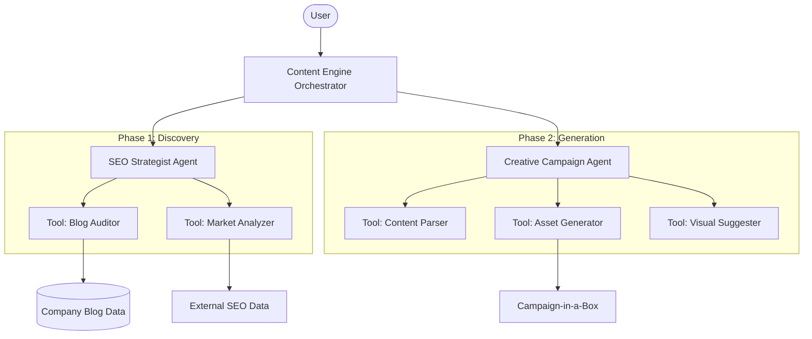

# Software Design Document: The End-to-End Content Engine

## 1. Executive Summary
The End-to-End Content Engine is an AI-powered solution designed to bridge the gap between strategic SEO discovery and multi-channel campaign execution. By utilizing a "Strategy-to-Execution" multi-agent architecture, the system automates the identification of high-value content gaps and the generation of comprehensive promotional assets.

---

## 2. Project Foundation (from SCOPE.md)

### Problem Statement
Marketing teams currently face significant delays and inefficiencies due to manual SEO research and the repetitive effort required to repurpose content for social media, email, and advertising.

### Core Objectives
1.  **Automated Strategy**: Audit internal content and market gaps to prioritize writing topics.
2.  **Multi-Channel Execution**: Concurrently generate all promotional assets for a new blog post.
3.  **Visual Integration**: Package text and images into a "Campaign-in-a-Box."

---

## 3. Technical Design (from SPEC.md)

### High-Level Architecture
The system is built on the **Google ADK** and deployed via **Vertex AI Reasoning Engines**. It orchestration follows a hub-and-spoke model where a central orchestrator delegates to specialized agents.

### Component Breakdown

#### Phase 1: Opportunity Discovery
The **SEO Strategist** agent identifies "Content Gaps" by comparing internal authority against market trends.
- **Input**: Website sitemap, Competitive keywords.
- **Process**: Gap Analysis Logic.
- **Output**: Content Gap Report (Prioritized List).

#### Phase 2: Campaign Generation
The **Creative Agent** transforms long-form content into a suite of assets.
- **Text Assets**: Social posts (X, LinkedIn), Email copy, Search Ads.
- **Visual Assets**: Suggests brand images or generates new visuals via Imagen.
- **Packaging**: Consolidates all files for rapid deployment.

---

## 4. Implementation Details

### Technology Stack
- **Language**: Python 3.10+
- **LLM**: Gemini 2.5 Flash
- **Cloud Services**: Vertex AI (Agent Engine), Cloud Run (MCP Servers), BigQuery, Secret Manager.
- **Auth**: IAM Service Account (Least Privilege).

### Key Tools & Skills
- `Blog Auditor`: Parsing `sitemap.xml` and auditing existing content.
- `Content Parser`: Semantic extraction of themes and arguments.
- `Asset Generator`: Instruction-tuned prompts for channel-specific copy.

---

## 5. Success Metrics
- **Performance**: 25% Increase in Organic Traffic.
- **Efficiency**: 100% Increase in Campaign Launch Speed.
- **Reliability**: Automated evaluation (LLM-as-a-Judge) for all generated assets.
